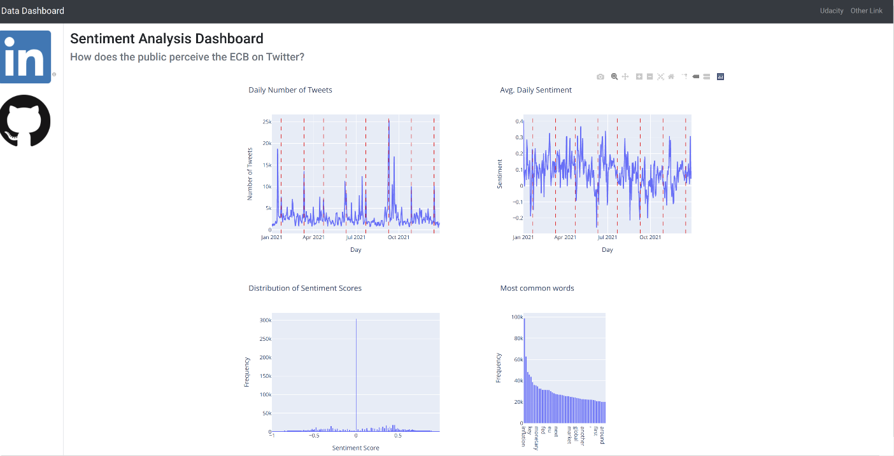

# Capstone Project: Twitter Sentiment about the European Central Bank

## Project Overview

This project is part of the Udacity Data Scientist Nanodegree Program. Its purpose is analyse tweets about the European Central Bank (ECB) and obtain results about the volume of tweets, the sentiment of the tweets and the discussed topics. In addition, the projects creates a flask web app to illustrate some of those insights.

## Problem Statement
Specifically, the following questions will be addressed:

- What are the topics discussed by users on Twitter? (Part 1)
- Does Twitter traffic (i.e. the number of tweets) respond to key ecb decision dates? (Part 2)
- Does Twitter Sentiment change on days when the ECB decided on its monetary policy? (Part 3)

## Setting:

The European Central Bank holds a policy meeting approximately every six weeks. An important part of monetary policy is the guidance of future expectations. For this reason, reactions / discussions on Twitter could be a useful signal for monetary policy.

## Metrics

The topic modelling / Latent Dirichlet Allocation will focus on the metric of perplexity.

Formally, the metric of perplexity is defined for a set of unseen documents $\omega$.

$$
\text{Perplexity}(\omega) = \exp(-\frac{\mathcal{L}(\omega)}{\text{count of tokens}})
$$
where the log likehood function is itself defined as a probability of obtaining this unseen document given the topics $\Omega$ and a hyperparameter $\alpha$ governing the topic distribution of documents.
$$
\mathcal{L}(\omega) = \log p(\omega | \Omega, \alpha)
$$
(See this link for formal definitions and better graph equations since GitHub's markdown does not seem to render the latex equations nicely [link](http://qpleple.com/perplexity-to-evaluate-topic-models/)).

On a more intuitive level, perplexity is a statistic to describe how well a probability model (here, our topic model) predicts an unseen sample.(See, for example, [here](https://cfss.uchicago.edu/notes/topic-modeling/#:~:text=Perplexity%20is%20a%20statistical%20measure,of%20words%20in%20your%20documents.)). In general, a lower perplexity is more desirable as its inversely related to the log likelihood.

The analysis of Twitter traffic and the Sentiment Analysis will focus on the simpler and straightforward metrics of the number of tweets and the compound sentiment:

- The daily number of tweets as a proxy for importance: More tweets mean that there is more discussion about the ECB on this particular day
- The compound sentiment (provided by VaderSentiment, a sentiment analysis tool for social media, see link below). In short, a positive / negative score is associated to each word in the tweet. The compound
sentiment is the sum of all words in a tweet and then normalized to be between 0 and 1.

## Data

Two data sources are used for the web app:

- A dataset of tweets from 2021 mentioning the European Central Bank or the acronym ECB on Twitter. The dataset is stored in an AWS S3 Bucket
- A dataset of ECB policy events scraped from the ECB website

## Files

- read_tweets_and_extract_sentiment.py

This file reads and cleans the tweets. It flattens and converts the tweets from json files into a pandas dataframe. To this end, it collapses all tweet text columns (text of the tweet, quoted tweet, retweeted tweet, etc) into a single column. This column is then used for a sentiment analysis. To perform the sentiment analysis, the VADER sentiment analysis tool (https://github.com/cjhutto/vaderSentiment) is used. This tool is part of the nltk library and specifically designed to analyse social media.

- capstone_project.default.cfg

This config file should be filled with the AWS credentials and the name of the AWS S3 bucket

- read_monetary_policy_decisions.py

This python file scrapes all decision dates from the ECB's homepage and saves them as a csv in ecb_decision_dates.csv (located in webapp/data)

- topic_modelling_with_tweets.py

This file loads the tweets and applies the LDA topic modelling to it. The evaluation metrics and topics are printed to the console, the word clouds are saved in the folder ./Figures .

- webapp_venv: This folder contains the virtual environment for running this repository and the webapp

## How to execute the analysis

1. Complete the AWS credentials with your credentials, fill out the name of the AWS S3 bucket and save the file as capstone_project.cfg

2. Run read_monetary_policy_decisions.py to generate the csv with the ECB decision dates

3. Run read_tweets_and_extract_sentiment.py: This generates the data as a pickle (and also csv file) in the folder webapp/data

4. Run ecb_sentiment_app.py in the webapp folder. Open the suggested url (it may take a while to load). The url should look like the screenshot in results below.

5. For the topic modelling, run the python script topic_modelling_with_tweets.py .

## Data Exploration

The analysis in the webapp ecb_sentiment_app.py (step 4) takes two datasets built
in step 3, the dataset /webapp/data/df_tweets.pkl. and step 2, the dataset webapp/data/ecb_decision_dates.csv.

After filtering for the year 2021 and only focusing on English language tweets and
excluding all tweets with the word cricket (that the streaming strategy with the keyword ecb might erroneously capture due to the English Wales Cricket Board (ECB as well)),
the final dataset consists of 1246881 tweets with the following columns:
id, created_at, all_text, compound, user_id, user_followers_count, user_verified, lang.

The compound score corresponds to the Vader Sentiment metric (see above). The user information is not used as part of this analysis but retained here for future work.
The column all_text comprises all text of a tweet (including mentioned retweets or quoted tweets).

The data set ecb_decision dates simply contains the dates for all monetary policy ecb_decision_dates in 2021. There were nine events in 2021 that will be the focus of this analysis (red dashed line in graphs below).

## Data Visualization

See the discussion in Results / Justification for more details.

## Data Preprocessing

The tweets streamed from Twitter come in json-files with a lot of meta information.
The file read_tweets_and_extract_sentiment.py flattens those tweets and keeps only the most
important columns for this analysis.

The preprocessing of the tweets is an important step. As mentioned above, a key step here is
to remove tweets about "Cricket" since streaming tweets about the European Central Bank with the abbreviation ECB also captures (to a small, but not negligible effect) tweets about the
England Wales Cricket Board, also ECB. Here, this is ensured by deleting all tweets with the
word 'Cricket'. This can be refined in the future by including more cricket specific words or by a ML algorithm.

## Implementation

See the description under "How to execute the analysis" in general.

## Refinement

The stopwords from NLTK do not capture all stopwords in Tweets (like RT for Retweet).
Those words have been manually added to the list of stopwords to not influence the most often used words. Also some users feature in the most often used words,
probably stemming from bots or bots replying to those users. Those users are also included in the list of stopwords.

## Model Results, Evaluation and Justification (regarding part 1)

This section discusses the results of the topic model. Using Latent Dirichlet Allocation with eight components, the following topics have been found (here with the 10 most important words for them). In the figures folder, those topics are also illustrated using word clouds.

Topic 1:
eur us week day usd meeting decision president fed today

Topic 2:
bitcoin christine money president global business european laundering regulation currency

Topic 3:
england test bcci pakistan tour players india series ipl match

Topic 4:
key european today chief drop pairs jordan footsites fsn report

Topic 5:
inflation policy european rates bond says monetary euro climate pandemic

Topic 6:
world us time whole vaccinate come new support back order

Topic 7:
euro digital european would people draghi money eu think want

Topic 8:
balance sheet fed inflation assets printing total hit keeps ath

The first topic seems to classify tweets discussing exchange rates and central bank meetings, which typically have an influence on the future path of exchange rates.
The second topic seems to capture tweets about cryptocurrencies like bitcoin and central bank discussions whether those cryptocurrencies should be regulated to prevent money laundering.
The third topic is about cricket and shows that for future work, more sophisticated cleaning steps are needed since the acronym ECB also captures the England Wales Cricket Board. For example, tweets with weight on the third topic could be used to classify a supervised machine learning model to eliminate cricket tweets.
The fourth topic seems to be about economic news whereas the fifth topic captures discussions about inflation, monetary policy and interest rates.
The sixth topic includes general world news, the seventh topic discussions about central bank digital currencies and finally, the eighth topic discussions about central bank balance sheets and asset prices.

5% of the data are randomly withdrawn from this training data and used for model evaluation here. The perplexity on this holdout set is 1634. This is itself meaningless and difficult to interpret (see [link here](https://cfss.uchicago.edu/notes/topic-modeling/#:~:text=Perplexity%20is%20a%20statistical%20measure,of%20words%20in%20your%20documents.)) but for comparison, the perplexity on the training data is 1449, showing that there is not too much loss in going from the training to the unseen data.

## Results / Justification (regarding part 2 and part 3)

The first graph shows the daily number of tweets related to the ECB (blue line) and the ECB key decision dates (dashed red line). It is visible that Twitter is used as a medium to discuss and share news about ECB decisions, which clearly answers the first question.

The second graph shows the average daily sentiment (blue line) and the key ECB decision dates (dashed red line). Here, there is no clear pattern but it seems that if anything, the decision dates correspond to the lower points in the sentiment curve. That means, that overall users do not seem to have a positive sentiment towards the actions. However, this pattern does not hold on all decision dates.

The third graph shows the distribution of the sentiment score of the single tweets. As it is visible, the clear majority of tweets have a neutral sentiment, which means that most users discuss the ECB's monetary policy rather objectively and without big sentiment.

The fourth graph shows the words used most often by Twitter users (stopwords and Twitter terms such as 'RT' for retweet have been removed). It becomes clear that the most often used word discussed about the ECB is "inflation". On the one hand, given the ECB's mandate to ensure price stability, it is reassuring that the ECB's policy discussion is around its strategic objective. On the other hand, it is surprising that the pandemic is mentioned far less often in 2021 than "climate". Apparently, more users seem to join the debate whether the ECB should fight climate change rather than the ECB's pandemic policy.

## Reflection and Improvement

This project has shown that Twitter is a useful medium to discuss the responses about monetary policy decisions by the ECB.

To extend the project, first of all the data cleaning could be incorporated to filter out more tweets about cricket (that the ECB keyword also captures). For example, key players could be incorporated here or a machine learning algorithm could be used for cleaning.
Another extension is data fields from Twitter that have not been used so far. It would be interesting to see whether there are differences between users with more followers or verified users. Last but not least, it would be useful to analyse the changes in sentiment and discussed topics more clearly. Did topics change over time and do those changes explain the changes in sentiment?
